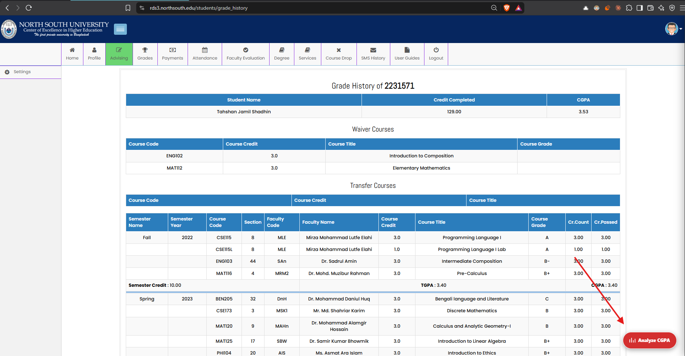
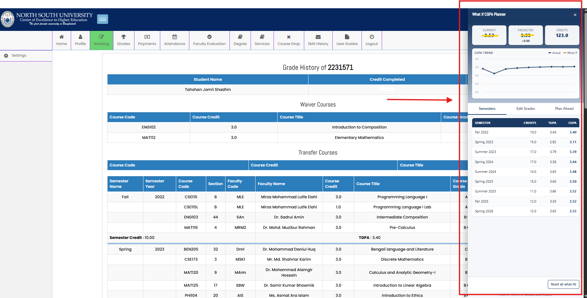
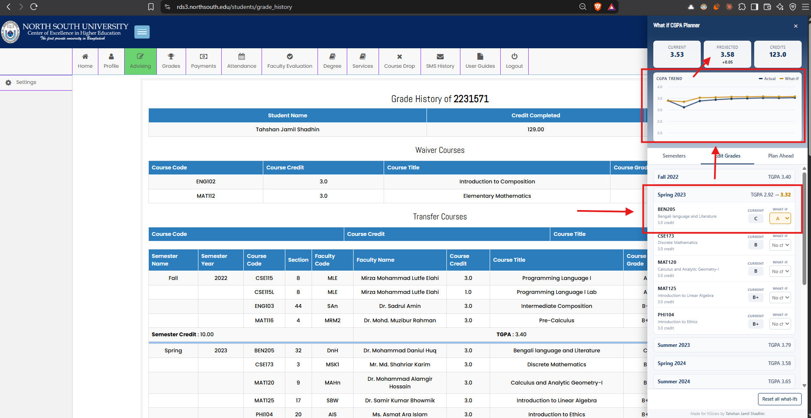
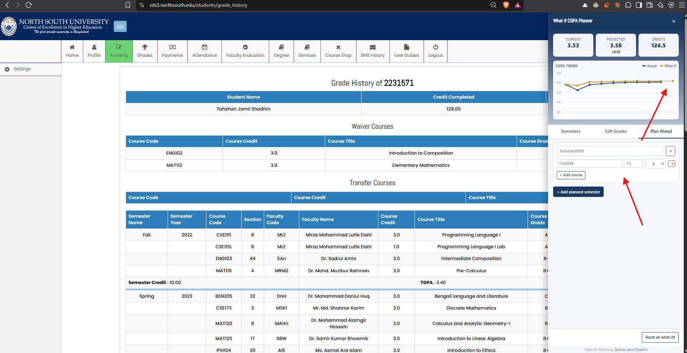
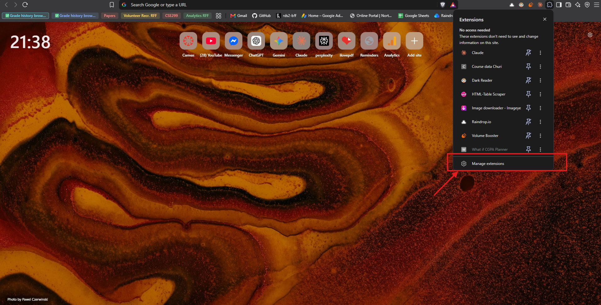
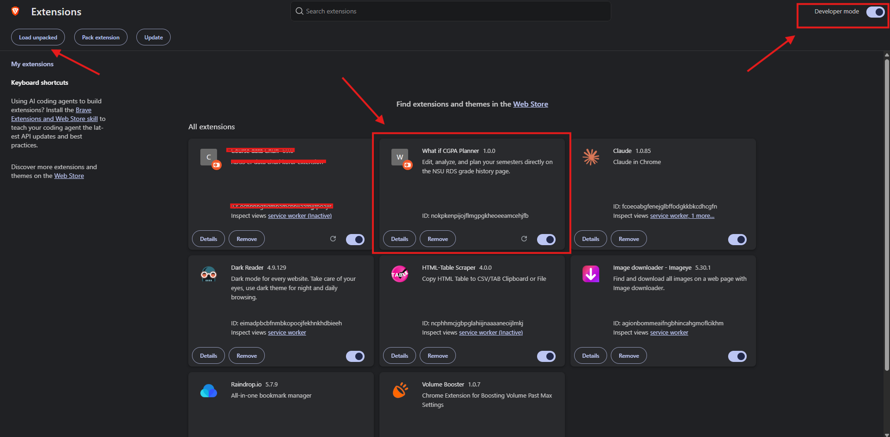

# What if CGPA Planner

**[⬇ Get it on the Chrome Web Store](https://chromewebstore.google.com/detail/koekeocjmjcbinjpfpijockklageaknd?utm_source=item-share-cb)**

A Chrome extension that overlays North South University's RDS **Grade History** page with a CGPA analysis and "what-if" planning tool — so you can explore hypothetical grade changes and plan future semesters without touching your real academic record.

It only activates on NSU RDS3 pages — the CGPA planner on `rds3.northsouth.edu/students/grade_history`, and the Mini-RDS3 widget on that page plus the `landing` page. Everywhere else, it does nothing.

This is an **open-source, community project** — built for NSU students, by an NSU student. Contributions, bug reports, and feature ideas are very welcome. See [Contributing](#contributing) below.

## Gallery

| | |
|---|---|
|  |  |
| The floating button appears only on the grade history page | Semesters tab — trend chart, honors badge, per-semester TGPA/CGPA |
|  |  |
| Edit Grades — change a grade, see the TGPA update and the what-if line appear on the chart | Plan Ahead — add a hypothetical future semester and course |

## Why

The official grade history page shows you your CGPA, but it's static. Students constantly ask "what if I retake this course and get an A?" or "what CGPA do I need next semester to graduate with honors?" — and end up doing the math by hand or in a spreadsheet. This extension answers those questions right on the page you already use.

## Features

- **Floating "Analyze CGPA" button** — appears only on the grade history page, opens a side panel with everything below.
- **Live CGPA trend chart** — always visible in the panel header, plots your actual CGPA per semester.
- **What-if grade editor** — change any past course's grade and watch your semester TGPA and cumulative CGPA recalculate instantly, without affecting your real transcript. The chart draws a second line so you can compare your actual trajectory against the edited one.
- **Plan Ahead** — add hypothetical future semesters and courses (with expected grades) to project where your CGPA is headed.
- **Retake handling** — if the same course code appears more than once (a retake), only the best-grade attempt counts toward CGPA and credits, matching how retakes actually work.
- **Latin honors tracking** — shows whether your current or projected CGPA qualifies for Cum Laude (3.50–3.64), Magna Cum Laude (3.65–3.79), or Summa Cum Laude (3.80–4.00).
- **100% local** — no servers, no accounts. Your what-if edits and planned semesters are saved with `chrome.storage.local`, scoped to your student ID, and never leave your browser.
- **Mini-RDS3 widget** — a second floating button (on the landing page and the grade history page) that shows today's class routine, your full weekly schedule, and last-class attendance status per course, without digging through RDS3's own pages.

## How it works

The extension is made up of two independent content scripts, both declared in `manifest.json`:

- **CGPA Planner** (`content.js` + `content.css`), injected only into the grade history page. It:
  1. Parses the existing HTML grade table directly from the DOM (no API calls, no scraping elsewhere).
  2. Recomputes TGPA/CGPA using NSU's official grading scale:

     | Grade | Points | Grade | Points | Grade | Points |
     |-------|--------|-------|--------|-------|--------|
     | A     | 4.0    | B     | 3.0    | C-    | 1.7    |
     | A-    | 3.7    | B-    | 2.7    | D+    | 1.3    |
     | B+    | 3.3    | C+    | 2.3    | D     | 1.0    |
     |       |        | C     | 2.0    | F     | 0.0    |

     (`W` and `I` are excluded from GPA calculations, as they are officially.)
  3. Renders a floating panel with the trend chart, a per-semester breakdown, the grade editor, and the semester planner.

  The math has been verified against real transcripts — recomputed CGPA and per-semester TGPA match the official values exactly.

- **Mini-RDS3** (`mini-rds3.js` + `mini-rds3.css`), injected into both the landing page and the grade history page. It detects your current semester, fetches your registered courses and per-course attendance directly from your own RDS3 session (same-origin requests only, cached for a few minutes), and renders them as a floating "Today" / "Full Routine" widget.

## Installation

**[Install it from the Chrome Web Store](https://chromewebstore.google.com/detail/koekeocjmjcbinjpfpijockklageaknd?utm_source=item-share-cb)** — this is the recommended way to get the extension.

To run a development build instead (e.g. to test a change before it's published), load it unpacked:

1. Clone or download this repository.
2. Click the puzzle-piece icon in Chrome's toolbar and choose **Manage extensions** to open `chrome://extensions`.

   

3. Enable **Developer mode** (top-right toggle) and click **Load unpacked**, then select the project folder you cloned/downloaded. Once loaded, it'll show up in your extensions list like this:

   

4. Visit your grade history page at `rds3.northsouth.edu/students/grade_history` — the "Analyze CGPA" button will appear in the bottom-right corner.

## Privacy

- There is no backend and no third-party data sharing. The CGPA Planner and Mini-RDS3 only ever talk to `rds3.northsouth.edu` — your own logged-in session — to read your grades, routine, and attendance.
- The extension sends anonymous, aggregated usage events (e.g. which panel/tab was opened) to Google Analytics via a write-only Measurement Protocol key, purely to understand feature usage. No grades, course data, or personally identifying information are included in these events.
- Your what-if grade edits and planned semesters are stored only in your own browser (`chrome.storage.local`), keyed to your student ID so multiple students on a shared computer don't see each other's plans.
- Uninstalling the extension or clearing site data removes all stored data.

## Contributing

Pull requests, issues, and ideas are all welcome — this is meant to be a community tool for NSU students. Some ideas if you're looking for a place to start:

- Export/print the what-if plan
- Support for waiver/transfer credits in the CGPA math
- A Firefox port

To contribute: fork the repo, make your changes to the content scripts (`content.js`/`content.css` for the CGPA Planner, `mini-rds3.js`/`mini-rds3.css` for Mini-RDS3) or `manifest.json`, test by loading it unpacked, and open a PR.

## License

MIT — see [LICENSE](LICENSE). Do whatever you want with this, just keep the license notice.

## Credits

Made for NSUers by **[Tahshan Jamil Shadhin](https://www.facebook.com/tahshanjamil.shadhin)**.
